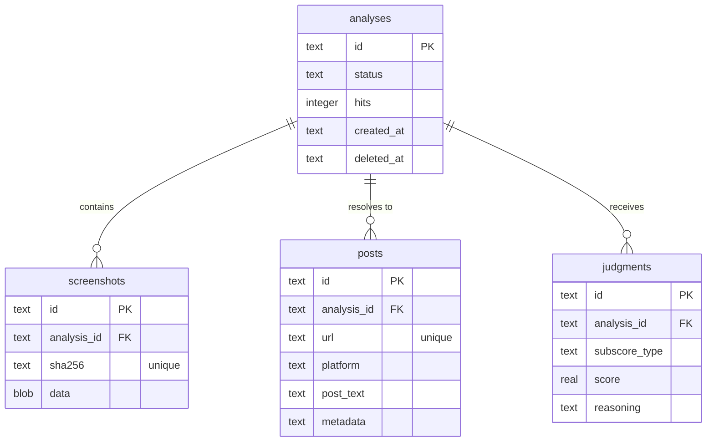

# Postcard design document

> **Team:** [Ethan](https://github.com/EthanThatOneKid), [Yves](https://github.com/hallowsyves)  
> **Event:** PantherHacks 2026 (April 3–5, 2026)  
> **Track:** Cybersecurity
> **Stack:** Next.js, TypeScript, Tailwind, Google Gemini, Vercel AI SDK v6, Drizzle ORM, Turso/libSQL, Jina Reader

## Project vision

Postcard reverses the entropy of social media screenshots by tracing them back to their source. When users upload a screenshot, Postcard locates the original post, fetches its live metadata, and calculates a **Postmark score** to reveal how much the content has drifted from the truth.

### Core problem

Screenshots strip context. Cropped text, missing timestamps, and altered engagement counts make it easy to spread misinformation. Postcard restores that context by finding the primary source and auditing it for forensic consistency.

### Out of scope

- Tracing multi-step attribution chains.
- Wayback Machine historical lookups (deferred for MVP).
- Mobile application (web-first for hackathon).

## Technical architecture

Postcard operates as a sequential pipeline using **AI SDK v6** for structured forensic extraction and grounding.

### Pipeline stages

#### Image preprocessor

The preprocessor uses **Sharp** to normalize contrast, adjust brightness, and sharpen the image. This optimization ensures high-quality OCR results in the next stage.

#### OCR and platform inference

Gemini 2.5/3+ analyzes the processed image to extract structured metadata and **infer the social media platform** (X, YouTube, Reddit, Instagram, or 'Other'). This inference is critical for direct search dorking.

```typescript
import { z } from "zod";

export const PostmarkSchema = z.object({
  username: z.string().optional().describe("Found handles like @username"),
  timestampText: z
    .string()
    .optional()
    .describe('Relative or absolute timestamp (e.g. "2h ago")'),
  platform: z
    .enum(["X", "YouTube", "Reddit", "Instagram", "Other"])
    .default("Other"),
  engagement: z
    .object({
      likes: z.string().optional(),
      retweets: z.string().optional(),
      views: z.string().optional(),
    })
    .optional(),
  mainText: z.string().describe("The primary text content of the post"),
});
```

#### Post resolution and Jina scrape

The navigator agent uses the inferred platform and OCR metadata to locate the **specific source URL** of the post.

**Jina Reader integration:** Once the agent resolves the unique post URL (e.g., `https://twitter.com/user/status/123`), it uses the **Jina Reader API** (`https://r.jina.ai/<url>`) to scrape the **live metadata** (exact like counts, character-by-character text, absolute timestamps). This serves as our "ground truth" for the post itself.

#### Primary source corroboration (Google Dorking)

Using an allowlist of trusted domains, the auditor performs **Google Dorking** to identify primary sources (news articles, official statements, repository logs) that verify or refute the post's content.

| Platform        | Operator Example                             | Purpose                             |
| :-------------- | :------------------------------------------- | :---------------------------------- |
| **X (Twitter)** | `site:twitter.com intext:"exact phrase"`     | Find specific posts by content.     |
| **YouTube**     | `site:youtube.com "video title"`             | Locate specific video descriptions. |
| **Reddit**      | `site:reddit.com/r/subreddit "thread title"` | Narrow to specific communities.     |
| **News**        | `site:nytimes.com "statement context"`       | Find corroborating primary sources. |

The final **Postmark score** is calculated by comparing the screenshot, the Jina-scraped post metadata, and the dorked primary sources.

## Database schema

Postcard uses **Drizzle ORM** with **Turso/libSQL** for type-safe server-side caching and forensic log storage. This ensuring high performance with zero cold-start penalties in serverless environments.

### Entity relationship diagram



### Drizzle schema definition

We use **Drizzle-Zod** to automatically generate schema validation from our database tables.

```typescript
import {
  sqliteTable,
  text,
  real,
  blob,
  integer,
} from "drizzle-orm/sqlite-core";

export const analyses = sqliteTable("analyses", {
  id: text("id").primaryKey(),
  status: text("status").notNull(),
  hits: integer("hits").default(1).notNull(),
  createdAt: text("created_at").$defaultFn(() => new Date().toISOString()),
  deletedAt: text("deleted_at"),
});

export const screenshots = sqliteTable("screenshots", {
  id: text("id").primaryKey(),
  analysisId: text("analysis_id").references(() => analyses.id),
  sha256: text("sha256").unique().notNull(),
  data: blob("data").notNull(),
});

export const posts = sqliteTable("posts", {
  id: text("id").primaryKey(),
  analysisId: text("analysis_id").references(() => analyses.id),
  url: text("url").unique().notNull(), // Unique URL for caching
  platform: text("platform"),
  postText: text("post_text"),
  metadata: text("metadata"), // JSON Jina scrape results
});
```

## Caching strategy

Postcard caches forensic results at the **Resolved Post URL** level.

### Audit flow

- **OCR Step:** Extract text and infer platform from the screenshot.
- **Resolution Step:** Locate the unique Post URL using Google Dorking.
- **Cache Check:** Query the `posts` table for the resolved URL.
  - **Cache Hit:** Increment the `hits` count on the associated `analysis`. Serve cached forensic data and Postmark score.
  - **Cache Miss:** Scrape via Jina Reader, perform full corroboration, and persist a new forensic record.

This strategy ensures that multiple screenshots of the same post (different crops, qualities) share the same forensic audit trail while tracking the post's forensic "popularity."

## Postmark score logic

The system combines subscores into a weighted percentage (0–100%).

### Weighted formula

```javascript
// Score weights are arbitrary for the hackathon and easily adjustable.
const WEIGHTS = {
  ORIGIN: 0.4, // URL reachability
  TEMPORAL: 0.3, // Timestamp consistency
  VISUAL: 0.3, // UI fingerprint alignment
};

const TotalScore =
  O * WEIGHTS.ORIGIN + T * WEIGHTS.TEMPORAL + V * WEIGHTS.VISUAL;
```

### Subscore definitions

- **Origin (O):** Binary check. Is the source URL reachable and platform-consistent?
- **Temporal (T):** Proximity check. Does the screenshot timestamp match the metadata found online?
- **Visual (V):** UI audit. Do buttons, logos, and layout match the expected platform's "fingerprint"?

## User interface

- **Minimalist dark mode:** Postcard uses a sleek black background with vibrant accent colors for scores.
- **Drag-and-drop:** Users upload screenshots via a central landing zone.
- **Real-time audit log:** The dashboard displays live updates (e.g., "Synthesizing queries...", "Auditing source...") to keep users engaged.
- **Progressive disclosure:** The interface shows the high-level score first, then allows users to expand for a detailed subscore breakdown and LLM reasoning.
