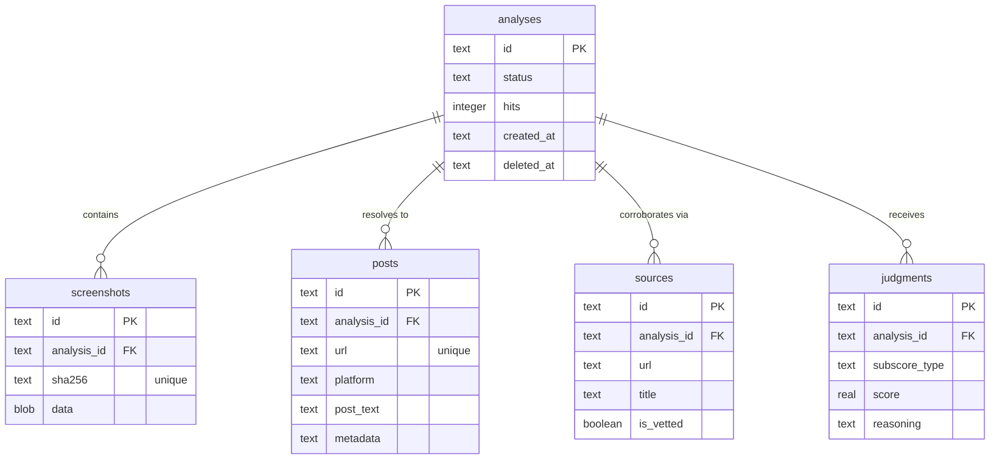

# Postcard design document

> **Team:** [Ethan](https://github.com/EthanThatOneKid), [Yves](https://github.com/hallowsyves)  
> **Event:** [PantherHacks 2026](https://pantherhacks2026.devpost.com/) (April 3–5, 2026)  
> **Track:** Cybersecurity
> **Stack:** Next.js, TypeScript, Tailwind, Google Gemini, Vercel AI SDK v6, Drizzle ORM, Turso/libSQL, Jina Reader

## Project vision

Postcard reverses the entropy of social media screenshots by tracing them back to their source. When users upload a screenshot, Postcard locates the original post, fetches its live metadata, and calculates a **postcard score** to reveal how much the content has drifted from the truth.

### Core problem

Screenshots strip context. Cropped text, missing timestamps, and altered engagement counts make it easy to spread misinformation. Postcard restores that context by finding the primary source and auditing it for forensic consistency.

### Out of scope

- Tracing multi-step attribution chains.
- Wayback Machine historical lookups (deferred for MVP).
- Mobile application (web-first for hackathon).

## Technical architecture

Postcard operates as a sequential pipeline using **AI SDK v6** for structured forensic extraction and grounding.

### Pipeline stages

#### Image preprocessor

The preprocessor uses **Sharp** to normalize contrast, adjust brightness, and sharpen the image. This optimization ensures high-quality OCR results in the next stage.

#### OCR and platform inference

Gemini 2.5/3+ analyzes the processed image to extract structured metadata and **infer the social media platform** (X, YouTube, Reddit, Instagram, or 'Other'). This inference is critical for direct search dorking.

```typescript
import { z } from "zod";

export const PostmarkSchema = z.object({
  username: z.string().optional().describe("Found handles like @username"),
  timestampText: z
    .string()
    .optional()
    .describe('Relative or absolute timestamp (e.g. "2h ago")'),
  platform: z
    .enum(["X", "YouTube", "Reddit", "Instagram", "Other"])
    .default("Other"),
  engagement: z
    .object({
      likes: z.string().optional(),
      retweets: z.string().optional(),
      views: z.string().optional(),
    })
    .optional(),
  mainText: z.string().describe("The primary text content of the post"),
});
```

#### Post resolution and Jina scrape

The navigator agent uses the inferred platform and OCR metadata to locate the **specific source URL** of the post.

**Navigator Agent System Prompt:**

```
You are the Postcard Navigator Agent. Given OCR output from a social media screenshot, find the original source URL.

INPUT:
- Extracted text (caption, comment, post body)
- Platform clues (Instagram UI, X/Twitter blue check, YouTube thumbnail style, etc.)
- @handles, timestamps, engagement counts

TASK:
1. Identify the most search-dense phrase (the "hook").
2. Combine with platform context to generate 2–3 targeted queries.
3. Prioritize exact-match searches with site: operators.

CONSTRAINTS:
- Maximum 3 search queries.
- Prefer primary sources over aggregators.
- Bias toward recent content (last 90 days) unless OCR shows older timestamp.
```

**Jina Reader integration:** Once the agent resolves the unique post URL (e.g., `https://twitter.com/user/status/123`), it uses the **Jina Reader API** (`https://r.jina.ai/<url>`) to scrape the **live metadata** (exact like counts, character-by-character text, absolute timestamps). This serves as our "ground truth" for the post itself.

#### Primary source corroboration (Google Dorking)

Using an allowlist of trusted domains, the auditor performs **Google Dorking** to identify primary sources (news articles, official statements, repository logs) that verify or refute the post's content.

**Vetted Source Allowlist (TLD-Permissive):**
A source is "vetted" if it belongs to a recognized institutional or journalistic TLD:

- **Government:** `.gov`, `.mil`
- **Academic:** `.edu`, `.ac.uk`, `.ac.*`
- **NGOs / Nonprofits:** `.org`

**News / Journalism (initial allowlist):**

```
reuters.com, apnews.com, nytimes.com, washingtonpost.com, wsj.com,
theguardian.com, bbc.com, cnn.com, foxnews.com, nbcnews.com,
abcnews.com, cbsnews.com, pbs.org, npr.org, usatoday.com, newsweek.com,
forbes.com, bloomberg.com, wired.com, arstechnica.com, techcrunch.com
```

| Platform        | Operator Example                             | Purpose                             |
| :-------------- | :------------------------------------------- | :---------------------------------- |
| **X (Twitter)** | `site:twitter.com intext:"exact phrase"`     | Find specific posts by content.     |
| **YouTube**     | `site:youtube.com "video title"`             | Locate specific video descriptions. |
| **Reddit**      | `site:reddit.com/r/subreddit "thread title"` | Narrow to specific communities.     |
| **News**        | `site:nytimes.com "statement context"`       | Find corroborating primary sources. |

The system calculates the final **postcard score** by comparing the screenshot, the Jina-scraped post metadata, and the dorked primary sources.

## Database schema

Postcard uses **Drizzle ORM** with **Turso/libSQL** for type-safe server-side caching and forensic log storage. This ensures high performance with zero cold-start penalties in serverless environments.

### Entity relationship diagram



### Drizzle schema definition

We use **Drizzle-Zod** to automatically generate schema validation from our database tables.

```typescript
import {
  sqliteTable,
  text,
  real,
  blob,
  integer,
} from "drizzle-orm/sqlite-core";

export const analyses = sqliteTable("analyses", {
  id: text("id").primaryKey(),
  status: text("status").notNull(),
  hits: integer("hits").default(1).notNull(),
  createdAt: text("created_at").$defaultFn(() => new Date().toISOString()),
  deletedAt: text("deleted_at"),
});

export const screenshots = sqliteTable("screenshots", {
  id: text("id").primaryKey(),
  analysisId: text("analysis_id").references(() => analyses.id),
  sha256: text("sha256").unique().notNull(),
  data: blob("data").notNull(),
});

export const posts = sqliteTable("posts", {
  id: text("id").primaryKey(),
  analysisId: text("analysis_id").references(() => analyses.id),
  url: text("url").unique().notNull(), // Unique URL for caching
  platform: text("platform"),
  postText: text("post_text"),
  metadata: text("metadata"), // JSON Jina scrape results
});

export const sources = sqliteTable("sources", {
  id: text("id").primaryKey(),
  analysisId: text("analysis_id").references(() => analyses.id),
  url: text("url").notNull(),
  title: text("title"),
  isVetted: integer("is_vetted", { mode: "boolean" }).default(false).notNull(),
});
```

## Caching strategy

Postcard caches forensic results at the **Resolved Post URL** level.

### Audit flow

- **OCR Step:** Extract text and infer platform from the screenshot.
- **Resolution Step:** Locate the unique Post URL using Google Dorking.
- **Cache Check:** Query the `posts` table for the resolved URL.
  - **Cache Hit:** Increment the `hits` count on the associated `analysis`. Serve cached forensic data and postcard score.
  - **Cache Miss:** Scrape via Jina Reader, perform full corroboration, and persist a new forensic record.

This strategy ensures that multiple screenshots of the same post (different crops, qualities) share the same forensic audit trail while tracking the post's forensic "popularity."

## User interface

- **Minimalist dark mode:** Postcard uses a sleek black background with vibrant accent colors for scores.
- **Drag-and-drop:** Users upload screenshots via a central landing zone.
- **Real-time audit log:** The dashboard displays live updates to keep users engaged.
- **Progressive disclosure:** High-level score first, then detailed subscore breakdown and LLM reasoning.

## Project structure (file map)

| File                          | Responsibility                                  |
| :---------------------------- | :---------------------------------------------- |
| `src/lib/postcard.ts`         | Pipeline entry point and top-level scoring.     |
| `src/lib/vision/processor.ts` | Image preprocessing (sharp).                    |
| `src/lib/vision/ocr.ts`       | AI SDK v6 OCR and platform Inference.           |
| `src/lib/agents/navigator.ts` | AI SDK v6 Navigator agent and search grounding. |
| `src/lib/agents/verifier.ts`  | Jina scrape and forensic auditor logic.         |

### postcard score logic

The system combines subscores into a weighted percentage (0–100%) to provide a high-fidelity forensic verdict.

#### Weighted formula

```javascript
// Weights are calibrated to prioritize origin reachability.
const WEIGHTS = {
  ORIGIN: 0.4, // URL reachability
  TEMPORAL: 0.3, // Timestamp consistency
  VISUAL: 0.3, // UI fingerprint & Bias analysis
};

const TotalScore =
  O * WEIGHTS.ORIGIN + T * WEIGHTS.TEMPORAL + V * WEIGHTS.VISUAL;
```

#### Subscore definitions

- **Origin (O):** Binary check. Is the source URL reachable and platform-consistent?
- **Temporal (T):** Proximity check. Does the screenshot timestamp match the metadata found online?
- **Visual (V):** UI audit + **Bias Judge**. Do platform fingerprints match, and hasn't the framing been distorted?

#### Bias score — LLM as judge

The LLM acts as a forensic media analyst, comparing the screenshot text against the fetched source.

**Prompt:**

```
You are a forensic media analyst. Your task is to compare the original source text (A) against the provided screenshot text (B) to identify distortions.

1. Caption changes — what text was added, removed, or altered?
2. Attribution drift — was the author credited correctly?
3. Framing shifts — was the editorial angle changed?
4. Context removal — was surrounding context stripped?

Output a score 0–100 where 100 = identical framing, 0 = completely distorted.
```

## REST API design

Postcard follows **Google AIP-121** (Resource-Oriented Design) and **AIP-122** (Standard Methods).

### Resource model: analysis

```typescript
Analysis {
  id:            string          // Server-assigned UUID
  status:        "processing" | "done" | "error"
  postmarkScore: number | null   // 0–100
  subscores: {
    origin:        number | null
    temporal:      number | null
    visual:        number | null
  } | null
  result: {
    postUrl:         string | null
    isVetted:        boolean | null
    vettedSources:   Array<{ url: string, title: string }> | null
  } | null
  biasExplanation: string | null
  createdAt: string              // RFC 3339
}
```

### Endpoints

| Method   | Path                 | Description                                        |
| :------- | :------------------- | :------------------------------------------------- |
| **POST** | `/api/analyses`      | Upload screenshot and start the forensic pipeline. |
| **GET**  | `/api/analyses/{id}` | Retrieve the analysis result and postcard score.   |

### Error contracts (AIP-193)

```json
{
  "error": {
    "code": 400,
    "message": "Human-readable description",
    "details": []
  }
}
```

## Vetted source allowlist (TLD-permissive)

A source is "vetted" if it belongs to a recognized institutional or journalistic TLD:

| Category          | TLDs                                      |
| ----------------- | ----------------------------------------- |
| Government        | `.gov`, `.mil`                            |
| Academic          | `.edu`, `.ac.uk`, `.ac.*` (international) |
| NGOs / Nonprofits | `.org`                                    |
| News / Journalism | See below                                 |

**News domains (initial allowlist):**

```
reuters.com, apnews.com, ap.co, nytimes.com, washingtonpost.com,
wsj.com, theguardian.com, bbc.com, bbc.co.uk, cnn.com, foxnews.com,
nbcnews.com, abcnews.com, abc.net.au, cbsnews.com, pbs.org,
npr.org, usatoday.com, latimes.com, politico.com, axios.com,
huffpost.com, theatlantic.com, wired.com, arstechnica.com,
techcrunch.com, theverge.com, independent.co.uk, dailymail.co.uk,
mirror.co.uk, express.co.uk, sky.com, newsweek.com, time.com,
forbes.com, bloomberg.com, reutersagency.com
```

**TLD-permissive logic:** Any domain ending in `.gov`, `.mil`, `.edu`, `.ac.*`, or `.org` is automatically vetted. No need to enumerate every subdomain.

## Bias score — LLM as judge

**Method:** LLM compares screenshot text against fetched source (or corroboration results).

**Prompt (simplified):**

```
You are a forensic media analyst. Compare the original text (A) against the screenshot text (B).

Assess:
1. Caption changes — what text was added, removed, or altered?
2. Attribution drift — was the author credited correctly?
3. Framing shifts — was the editorial angle changed?
4. Context removal — was surrounding context stripped?

Output a score 0–100 where 100 = identical framing, 0 = completely distorted.
Also output a short narrative explanation of what changed.
```

**Important:** Due to the probabilistic nature of LLMs, repeated runs will NOT produce identical scores but will be **consistent within an acceptable range**. This is expected.

## Caching (SQLite)

**Cache key:** MD5 hash of uploaded image bytes  
**Cache value:** Full analysis result (postcard score, all subscores, URL found, narrative)

**Flow:**

1. User uploads image
2. Compute MD5 hash
3. Check SQLite for existing result → instant response if hit
4. If miss → run pipeline → store result → return

## UI / UX

- **Mobile-first responsive** — follows best practices, no bloat
- **Dark mode** — `prefers-color-scheme` media query (no toggle needed)
- **Minimal** — Black/dark background
- **Core interaction:**
  1. Drag-and-drop or tap to upload
  2. Submit → loading state
  3. Result: postcard score (%) + expand for subscore breakdown

## Navigator agent — system prompt

```
You are a screenshot-to-URL resolution agent. Your mission is to take OCR output from a social media screenshot and find the absolute source URL.

INPUT:
- Extracted text (caption, comment, post body)
- Platform clues (Instagram UI, X/Twitter blue check, YouTube thumbnail style, Reddit upvote icon, etc.)
- Any @handles, timestamps, engagement counts

TASK:
1. Identify the most search-dense phrase (the "hook")
2. Combine with platform context to generate 2–3 targeted queries
3. Prioritize exact-match searches with quotes and site: operators
4. Return candidate source URLs ranked by confidence

OUTPUT:
{
  "candidates": [
    { "url": "...", "query": "...", "confidence": 0.9 }
  ]
}

CONSTRAINTS:
- Maximum 3 search queries
- Prefer primary sources over aggregators
- Bias toward recent content (last 90 days) unless OCR shows older timestamp
```

## Feature priority

### Must Ship (MVP)

- [ ] Image upload form (drag-and-drop)
- [ ] Step 1: Post Locator (Gemini 3+ multimodal → post URL)
- [ ] Step 2: URL fetch + metadata extraction
- [ ] Step 3: Corroboration search (Gemini Google Search tool)
- [ ] Step 4: Bias assessment (LLM judge)
- [ ] Step 5: postcard score + progressive disclosure
- [ ] SQLite caching
- [ ] Deployed live URL (Vercel)

### Future Work

- [ ] Wayback Machine historical lookup
- [ ] Weight optimization (labeled dataset or user feedback)
- [ ] Mobile app (Swift/Expo)
- [ ] Opinion vs. factual disambiguation

## Tech stack

- **Framework:** Next.js (TypeScript)
- **Styling:** Tailwind CSS
- **Hosting:** Vercel
- **Validation:** Zod
- **AI:** AI SDK (vcore) with multimodal Gemini (text + file inputs)
- **Persistence:** SQLite
- **API Style:** REST, Google AIPs compliant

**Key API:** `generativeLanguage.googleapis.com` — configure in [Settings > Advanced](/?t=settings&s=advanced) as `GEMINI_API_KEY`.

## REST API design

_Follows [Google AIP-121 Resource-Oriented Design](https://google.aip.dev/121) and [AIP-122 Standard Methods](https://google.aip.dev/122)._

### Resource Model

**Analysis** is the primary resource. An analysis represents a single screenshot submitted for Postcard verification.

```
Analysis {
  id:            string          // Server-assigned UUID
  status:        "processing" | "done" | "error"
  postmarkScore: number | null   // 0–100, null until done
  subscores: {
    origin:        number | null
    corroboration: number | null
    bias:          number | null
    temporal:      number | null
  } | null
  input: {
    screenshotUrl: string        // Presigned or base64 ref
  }
  result: {
    extractedClaim: string | null
    postUrl:         string | null
    isVetted:        boolean | null
    vettedSources:   string[] | null
  } | null
  corroboration: {
    sources: Array<{
      url:    string
      title:  string
      date:   string
      vetted: boolean
    }>
  } | null
  bias: {
    summary: string | null
    rating:  "low" | "medium" | "high" | null
  } | null
  error: string | null
  createdAt: string              // RFC 3339
  updatedAt: string              // RFC 3339
}
```

### Endpoints

#### Analyze (create analysis)

```
POST /api/analyses
Content-Type: multipart/form-data

Body: { file: ImageFile }

201 Created
{
  "id": "a1b2c3d4",
  "status": "processing",
  "createdAt": "2026-04-03T21:00:00Z"
}
```

#### Get Analysis (standard get)

```
GET /api/analyses/{id}

200 OK → Analysis (full object, see schema above)
404 Not Found → { "error": "Analysis not found" }
```

### Error Contracts

All errors follow AIP-193:

```
{
  "error": {
    "code":    400 | 404 | 500,
    "message": "Human-readable description",
    "details": []  // optional Zod-validation errors
  }
}
```

### Notes

- No batch or list endpoints for v1 hackathon scope
- No authentication in v1 (single-environment, venue demo)
- Polling `GET /api/analyses/{id}` until `status === "done"` constitutes the long-running operation pattern (AIP-151)

_Last updated: 2026-04-03 22:00 UTC_
