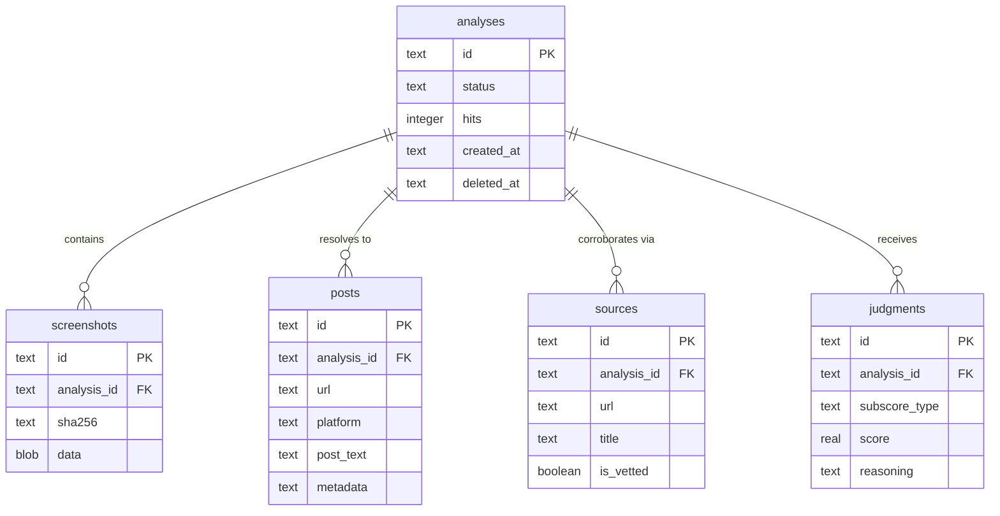

# Postcard technical design

> **Team:** [Ethan](https://github.com/EthanThatOneKid), [Yves](https://github.com/hallowsyves)  
> **Event:** [PantherHacks 2026](https://pantherhacks2026.devpost.com/) (April 3–5, 2026)  
> **Track:** [Cybersecurity / OSINT](https://pantherhacks2026.devpost.com/)
> **Stack:** Next.js, TypeScript, Tailwind, Google Gemini, Vercel AI SDK v6, Drizzle ORM, Turso/libSQL, Playwright, sharp

## Project vision

Postcard reverses the entropy of social media screenshots by tracing them back to their source. When users upload a screenshot, Postcard locates the original post, fetches its live metadata, and calculates a **postcard score** to reveal how much the content has drifted from the truth.

### Core problem

Screenshots strip context. Cropped text, missing timestamps, and altered engagement counts make it easy to spread misinformation. Postcard restores that context by finding the primary source and auditing it for forensic consistency.

### Out of scope

- Tracing multi-step attribution chains.
- Wayback Machine historical lookups (deferred for MVP).
- Mobile application (web-first for hackathon).

## Technical architecture

Postcard operates as a sequential pipeline using **AI SDK v6** for structured forensic extraction and grounding.

### Pipeline stages

#### Stage 1: preprocessor

The preprocessor uses **sharp** to normalize contrast, adjust brightness, and sharpen the image. This optimization ensures high-quality OCR results in the next stage.

#### Stage 2: OCR and platform inference

Gemini 2.5/3+ analyzes the processed image to extract structured metadata and **infer the social media platform** (X, YouTube, Reddit, Instagram, or 'Other'). This inference is critical for direct search dorking.

```typescript
import { z } from "zod";

export const PostcardSchema = z.object({
  username: z.string().optional().describe("Found handles like @username"),
  timestampText: z
    .string()
    .optional()
    .describe('Relative or absolute timestamp (e.g. "2h ago")'),
  platform: z
    .enum(["X", "YouTube", "Reddit", "Instagram", "Other"])
    .default("Other"),
  engagement: z
    .object({
      likes: z.string().optional(),
      retweets: z.string().optional(),
      views: z.string().optional(),
    })
    .optional(),
  mainText: z.string().describe("The primary text content of the post"),
});
```

#### Stage 3: navigator agent

The navigator agent uses the inferred platform and OCR metadata to locate the **specific source URL** of the post. It generates targeted search queries and prioritizes primary sources over aggregators.

**Jina Reader integration:** Once the agent resolves the unique post URL (e.g., `https://twitter.com/user/status/123`), it uses the **Jina Reader API** (`https://r.jina.ai/<url>`) to scrape the **live metadata** (exact like counts, character-by-character text, absolute timestamps). This serves as our "ground truth" for the post itself.

#### Stage 4: forensic auditor

Playwright scrapes the live URL to compute the final forensic subscores. Using an allowlist of trusted domains, the auditor performs **Google Dorking** to identify primary sources (news articles, official statements, repository logs) that verify or refute the post's content.

| Platform        | Operator example                       | Purpose                             |
| :-------------- | :------------------------------------- | :---------------------------------- |
| **X (Twitter)** | `site:twitter.com intext:"phrase"`     | Find specific posts by content.     |
| **YouTube**     | `site:youtube.com "video title"`       | Locate specific video descriptions. |
| **Reddit**      | `site:reddit.com/r/subreddit "thread"` | Narrow to specific communities.     |
| **News**        | `site:nytimes.com "statement context"` | Find corroborating primary sources. |

The system calculates the final **postcard score** by comparing the resolved post metadata, the live site state, and corroborated primary sources.

## Database and caching

Postcard uses **Drizzle ORM** with **Turso/libSQL** for type-safe server-side caching and forensic log storage.

### Caching strategy

Postcard caches forensic results at the **Resolved Post URL** level.

- **Cache Check:** Postcard queries the `posts` table for the resolved URL.
- **Cache Hit:** Increment the `hits` count on the associated `analysis`. Serve cached forensic data and the postcard score.
- **Cache Miss:** Scrape via Jina Reader, perform full corroboration, and persist a new forensic record.

### Entity relationship diagram



## The postcard score model

The system combines subscores into a weighted percentage (0–100%) to provide a high-fidelity forensic verdict.

### Weighted formula

```javascript
// Weights are calibrated to prioritize origin reachability and corroboration.
const WEIGHTS = {
  ORIGIN: 0.3, // URL reachability
  CORROBORATION: 0.25, // Independent source count
  BIAS: 0.25, // Editorial divergence
  TEMPORAL: 0.2, // Timestamp alignment
};

const TotalScore =
  O * WEIGHTS.ORIGIN +
  C * WEIGHTS.CORROBORATION +
  B * WEIGHTS.BIAS +
  T * WEIGHTS.TEMPORAL;
```

### Bias score (LLM judge)

The LLM acts as a forensic media analyst, comparing the screenshot text against the fetched source. It assesses caption changes, attribution drift, framing shifts, and context removal.

## REST API architecture

Postcard follows **Google AIP-121** (Resource-Oriented Design) and **AIP-122** (Standard Methods).

### Resource model: analysis

```typescript
Analysis {
  id:            string          // Server-assigned UUID
  status:        "processing" | "done" | "error"
  postcardScore: number | null   // 0–100
  subscores: {
    origin:        number | null
    corroboration: number | null
    bias:          number | null
    temporal:      number | null
  } | null
  result: {
    postUrl:         string | null
    isVetted:        boolean | null
    vettedSources:   Array<{ url: string, title: string }> | null
  } | null
  biasExplanation: string | null
  createdAt: string              // RFC 3339
}
```

### Endpoints

| Method   | Path                  | Description                                      |
| :------- | :-------------------- | :----------------------------------------------- |
| **POST** | `/api/postcards`      | Submit post URL and start forensic SSE stream.   |
| **GET**  | `/api/postcards/{id}` | Retrieve the analysis result and postcard score. |

### API design decisions

- **JSON-body for SSE:** The `POST /api/postcards` endpoint accepts a JSON body (e.g., `{ "url": "..." }`) rather than URL search parameters. This simplifies the OpenAPI specification and ensures robust handling of complex or long URLs.

## Forensic standards

### Vetted source allowlist

A source is "vetted" if it belongs to a recognized institutional or journalistic TLD:

- **Government:** `.gov`, `.mil`
- **Academic:** `.edu`, `.ac.uk`, `.ac.*`
- **NGOs:** `.org`
- **News:** Reuters, AP, NYT, Washington Post, WSJ, BBC, CNN, and other members of the initial allowlist.

### Search safety

The navigator agent prioritizes primary sources over aggregators and biases toward content from the last 90 days unless OCR evidence suggests otherwise.
