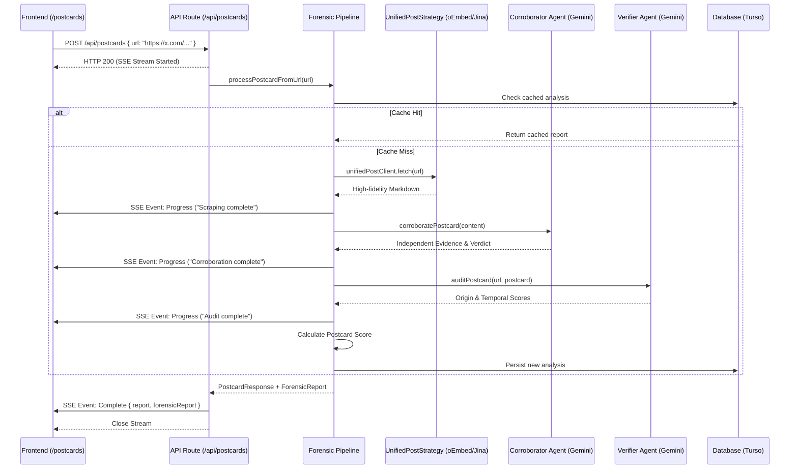

# Postcard

> _Democratizing the truth._

Postcard is a digital forensics tool dedicated to the democratization of
honesty. It takes any social media post and traces it back to its definitive
origin—calculating a postcard score of credibility by auditing how much the
content has drifted from the ground truth.

## Hackathon submission

**Track:** [Cybersecurity](https://pantherhacks2026.devpost.com/)\
**Submission:** [Devpost](https://devpost.com/software/postcard-bpx2mz)\
**Demo:** [postcard.fartlabs.org](https://postcard.fartlabs.org)\

## Pipeline architecture

## Flow

**User flow:** Enter Post URL → Forensic Pipeline Runs → Postcard Score +
Subscore Breakdown appears.

Postcard prioritizes the direct URL entrypoint to ensure absolute forensic
precision, while maintaining support for screenshot-to-URL resolution as an
additional quality-of-life feature.

## Product

Postcard is a digital forensics pipeline that takes a social media post URL,
traces it back to its original source, and produces a postcard score
(0–100%) measuring how much the content has drifted from the truth.

> _Democratizing the truth. Trace every post back to its source._

## The problem

Screenshots strip all context. By the time something goes viral, it's been
cropped, captioned, and misattributed. Postcard reverses this entropy by
finding the primary source and auditing it for forensic consistency—providing a
scalable solution for the democratization of honesty.

### Solution

We built a 4-stage forensic pipeline focused on deep audit log generation and
corroboration for social media posts:

1. **URL Entrypoint:** Users submit the direct source URL for forensic
   verification.
2. **Strategy-Based Ingest:** `UnifiedPostStrategy` delegates to specialized
   clients (Reddit JSON, YouTube oEmbed, X oEmbed, Instagram oEmbed, TikTok
   scraper) with Jina Reader as fallback for general websites.
3. **Corroboration:** Gemini agent performs Google Dorking across trusted
   domains (X, Reddit, News) to verify claims and identify primary sources.
4. **Verification:** Verifier agent checks URL reachability and temporal
   alignment against the post's timestamp.

## Lessons learned

A key technical takeaway from this hackathon was discovering how oEmbed APIs
can significantly enhance verifiable OSINT. While traditional scraping is
often blocked or inconsistent, leveraging official oEmbed endpoints (like those
from X, Instagram, and YouTube) provides a reliable, high-fidelity way to
capture metadata—such as author information and exact timestamps—directly from
the source without the fragility of manual extraction.

## Documentation

- [docs/CONTRIBUTING.md](docs/CONTRIBUTING.md): Comprehensive
  [Quick start](docs/CONTRIBUTING.md#quick-start) guide, technical stack,
  and architecture notes.
- [docs/DESIGN.md](docs/DESIGN.md): Full technical specification and
  pipeline stages.
- [docs/devpost.md](docs/devpost.md): High-level summary for
  the PantherHacks 2026 Devpost submission.
- [docs/PITCH.md](docs/PITCH.md): Pitch script and video cues.
- [Mintlify Documentation](https://www.mintlify.com/postcardhq/postcard): Hosted, interactive documentation for Postcard.
- [docs/API.md](docs/API.md): Full API reference with examples.
- [public/openapi.json](public/openapi.json): OpenAPI v3.1 Specification for SDK generation.

---

Built with 🐈‍⬛ at [PantherHacks 2026](https://pantherhacks2026.devpost.com/)
