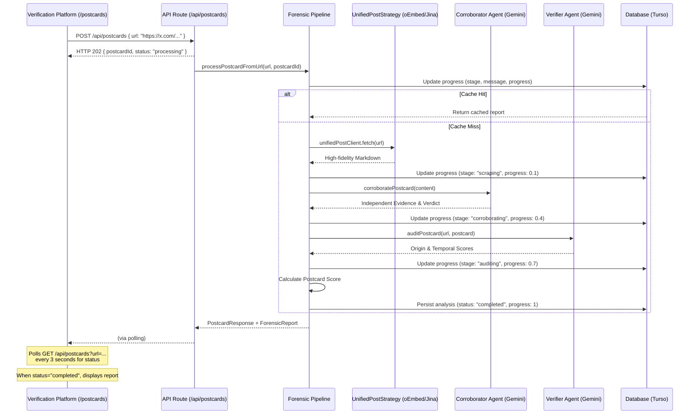

# Postcard

> _Trace the Truth._

Postcard is a digital forensics tool dedicated to tracing viral content back to its definitive source. By auditing how much a post has drifted from the ground truth, it calculates a **Postcard Score** to restore credibility in the post-truth era.

## Hackathon submission

**Track:** [Cybersecurity](https://pantherhacks2026.devpost.com/)\
**Submission:** [Devpost](https://devpost.com/software/postcard-bpx2mz)\
**Demo:** [postcard.fartlabs.org](https://postcard.fartlabs.org)\

## Pipeline architecture

## Flow

**User flow:** Enter Post URL → Forensic Pipeline Runs → Postcard Score +
Subscore Breakdown appears.

Postcard prioritizes the direct URL entrypoint to ensure absolute forensic
precision, while maintaining support for screenshot-to-URL resolution as an
additional quality-of-life feature.

## Product

Postcard is a digital forensics pipeline that takes a social media post URL,
traces it back to its original source, and produces a postcard score
(0–100%) measuring how much the content has drifted from the truth.

> _Trace the Truth._

## The problem

Screenshots strip all context. By the time something goes viral, it's been
cropped, captioned, and misattributed. Postcard utilizes the **"Wisdom of the Crowd"**
to triangulate the primary source and audit it for forensic consistency—providing a
scalable solution for restoring context and credibility.

### Solution

We built a 4-stage forensic pipeline focused on deep audit log generation and
corroboration for social media posts:

1. **Multimodal Ingest:** Utilizes Jina Reader to ingest live content and metadata, establishing the "ground truth" for the forensic audit.
2. **Forensic Audit:** Uses Playwright to perform direct site checks, verifying origin and ensuring temporal alignment with the reported narrative.
3. **Corroboration Engine:** Performs deep search across trusted domains to verify claims and find mentions of the content elsewhere to determine its "drift."
4. **Verification Platform:** Built with Next.js and Tailwind CSS, providing a clean, terminal-inspired interface for quick, simple forensic verification.

## Lessons learned

A key technical takeaway from this hackathon was discovering how oEmbed APIs
can significantly enhance verifiable OSINT. While traditional scraping is
often blocked or inconsistent, leveraging official oEmbed endpoints (like those
from X, Instagram, and YouTube) provides a reliable, high-fidelity way to
capture metadata—such as author information and exact timestamps—directly from
the source without the fragility of manual extraction.

## Documentation

- [docs/CONTRIBUTING.md](docs/CONTRIBUTING.md): Comprehensive
  [Quick start](docs/CONTRIBUTING.md#quick-start) guide, technical stack,
  and architecture notes.
- [docs/DESIGN.md](docs/DESIGN.md): Full technical specification and
  pipeline stages.
- [docs/devpost.md](docs/devpost.md): High-level summary for
  the PantherHacks 2026 Devpost submission.
- [docs/PITCH.md](docs/PITCH.md): Pitch script and video cues.
- [Mintlify Documentation](https://www.mintlify.com/postcardhq/postcard): Hosted, interactive documentation for Postcard.
- [API Reference](https://postcard.fartlabs.org/api/reference): Interactive API reference (Scalar).
- [docs/API.md](docs/API.md): Full API reference with examples.
- [public/openapi.json](public/openapi.json): OpenAPI v3.1 Specification for SDK generation.

---

Built with 🐈‍⬛ at [PantherHacks 2026](https://pantherhacks2026.devpost.com/)
