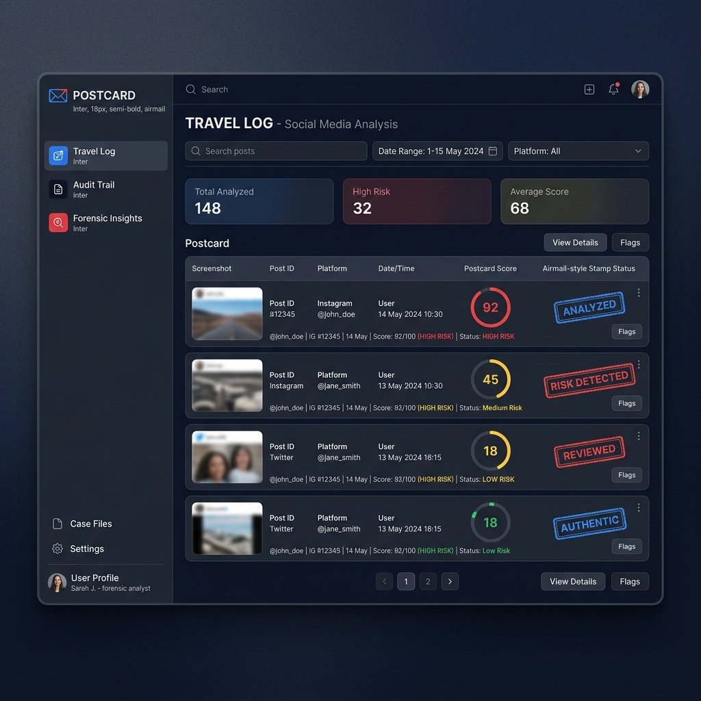

# Postcard

> _Trace every post back to its source._

**Postcard** is a digital forensics tool that takes a social media post and traces it back to its definitive origin—calculating a **postcard score** of credibility by auditing how much the content has drifted from the primary source.

## PantherHacks 2026 submission

**Track:** [Cybersecurity](https://pantherhacks2026.devpost.com/)  
**Challenge:** Rebuilding trust in a "post-truth" digital era.  
**Pitch Script:** [View Video Script](./PITCH.md)

## How it works

**User flow:** Enter Post URL → Forensic Pipeline Runs → Postcard Score + Subscore Breakdown appears.

Postcard prioritizes the direct URL entrypoint to ensure absolute forensic precision, while maintaining support for screenshot-to-URL resolution as an additional quality-of-life feature.

## What it does

**Postcard** is a digital forensics pipeline that takes a social media post URL, traces it back to its original source, and produces a **postcard score (0–100%)** measuring how much the content has drifted from the truth.

> _Trace every post back to its source._

## The problem

Screenshots strip all context. By the time something goes viral, it's been cropped, captioned, and misattributed. A screenshot of a tweet looks nothing like the original tweet. Postcard reverses this entropy by finding the primary source and auditing it for forensic consistency.

### The solution: the "Postcard" pipeline

We built a 4-stage forensic pipeline focused on deep audit log generation and corroboration for social media posts:

1. **URL Entrypoint:** Users submit the direct source URL for forensic verification.
2. **Multimodal Ingest:** Jina Reader ingests live content to establish ground truth.
3. **Forensic Audit:** Playwright and direct site checks verify origin and temporal alignment.
4. **Corroboration:** Deep search across trusted domains (X, Reddit, News) to verify claims.

## Documentation

- **[DESIGN.md](DESIGN.md):** Full technical specification and pipeline stages.
- **[PROJECT_SUMMARY.md](PROJECT_SUMMARY.md):** High-level summary for the PantherHacks 2026 Devpost submission.
- **[PITCH.md](PITCH.md):** Pitch script and video cues.
- **[CONTRIBUTING.md](CONTRIBUTING.md):** Contributor notes, technical stack, and quick start guide.
