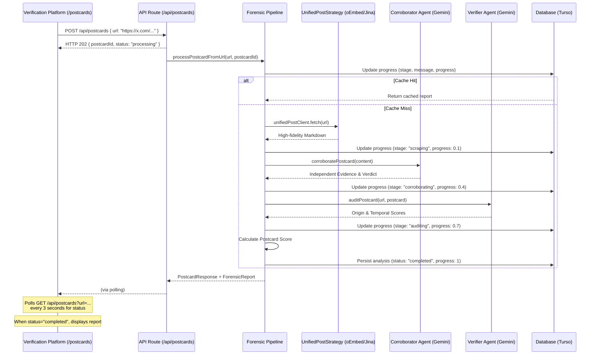

# Postcard

> _Trace the Truth._

Postcard is a digital forensics tool dedicated to tracing viral content back to its definitive source. By auditing how much a post has drifted from the ground truth, it calculates a **Postcard Score** to restore credibility in the post-truth era.

## Hackathon submission

- **Track** [Cybersecurity](https://pantherhacks2026.devpost.com/)
- **Submission** [Devpost](https://devpost.com/software/postcard-bpx2mz)
- **Demo** [postcard.fartlabs.org](https://postcard.fartlabs.org)
- **Docs** [Mintlify](https://www.mintlify.com/postcardhq/postcard)

## Pipeline architecture

## User flow

Users enter a post URL, which triggers the forensic pipeline. Postcard then displays a **Postcard Score** and a detailed subscore breakdown.

Postcard prioritizes the direct URL entrypoint to ensure absolute forensic precision, while maintaining support for screenshot-to-URL resolution as an additional quality-of-life feature.

## Product overview

Postcard is a digital forensics pipeline that takes a social media post URL, traces it back to its original source, and produces a **Postcard Score** (0–100%) measuring how much the content has drifted from the truth.

> _Trace the Truth._

## The problem

Screenshots strip all context. By the time something goes viral, it's been cropped, captioned, and misattributed. Postcard utilizes the **"Wisdom of the Crowd"** to triangulate the primary source and audit it for forensic consistency—providing a scalable solution for restoring context and credibility.

### Our solution

We built a 4-stage forensic pipeline focused on deep audit log generation and corroboration for social media posts:

- **Multimodal ingest.** Postcard utilizes Jina Reader to ingest live content and metadata, establishing the "ground truth" for the forensic audit.
- **Forensic audit.** Postcard uses Playwright to perform direct site checks, verifying origin and ensuring temporal alignment with the reported narrative.
- **Corroboration engine.** Postcard performs deep search across trusted domains to verify claims and find mentions of the content elsewhere to determine its "drift."
- **Verification platform.** Built with Next.js and Tailwind CSS, providing a clean, terminal-inspired interface for quick, simple forensic verification.

## Documentation

- [Postcard Documentation](https://www.mintlify.com/postcardhq/postcard). Official external documentation site.
- [docs/SUBMISSION.md](docs/SUBMISSION.md). PantherHacks 2026 submission summary, pitch script, and demo links.
- [docs/DESIGN.md](docs/DESIGN.md). Full technical specification, architecture, and pipeline stages.
- [docs/CONTRIBUTING.md](docs/CONTRIBUTING.md). Development environment setup, manual testing guide, and style guide.
- [docs/API.md](docs/API.md). Public API reference and standard polling patterns.
- [public/openapi.json](public/openapi.json). OpenAPI v3.1 Specification for SDK generation.

---

Built with 🐈‍⬛ at [PantherHacks 2026](https://pantherhacks2026.devpost.com/)
