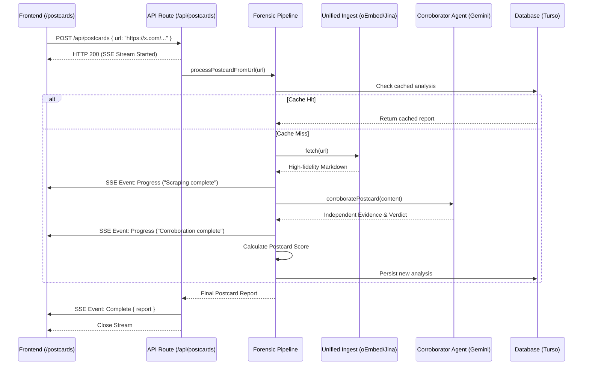

# Postcard

> _Trace every post back to its source._

**Postcard** is a digital forensics tool that takes a social media post and traces it back to its definitive origin—calculating a **postcard score** of credibility by auditing how much the content has drifted from the primary source.

## Hackathon submission

**Track:** [Cybersecurity](https://pantherhacks2026.devpost.com/)  
**Challenge:** Rebuilding trust in a "post-truth" digital era.  
**Pitch Script:** [View Video Script](./PITCH.md)

## Pipeline architecture

## Flow

**User flow:** Enter Post URL → Forensic Pipeline Runs → Postcard Score + Subscore Breakdown appears.

Postcard prioritizes the direct URL entrypoint to ensure absolute forensic precision, while maintaining support for screenshot-to-URL resolution as an additional quality-of-life feature.

## Product

**Postcard** is a digital forensics pipeline that takes a social media post URL, traces it back to its original source, and produces a **postcard score (0–100%)** measuring how much the content has drifted from the truth.

> _Trace every post back to its source._

## The problem

Screenshots strip all context. By the time something goes viral, it's been cropped, captioned, and misattributed. A screenshot of a tweet looks nothing like the original tweet. Postcard reverses this entropy by finding the primary source and auditing it for forensic consistency.

### Solution

We built a 4-stage forensic pipeline focused on deep audit log generation and corroboration for social media posts:

1. **URL Entrypoint:** Users submit the direct source URL for forensic verification.
2. **Multimodal Ingest:** Jina Reader ingests live content to establish ground truth.
3. **Forensic Audit:** Playwright and direct site checks verify origin and temporal alignment.
4. **Corroboration:** Deep search across trusted domains (X, Reddit, News) to verify claims.

## Lessons learned

A key technical takeaway from this hackathon was discovering **how oEmbed APIs can significantly enhance verifiable OSINT**. While traditional scraping is often blocked or inconsistent, leveraging official oEmbed endpoints (like those from X, Instagram, and YouTube) provides a reliable, high-fidelity way to capture metadata—such as author information and exact timestamps—directly from the source without the fragility of manual extraction.

## Documentation

- **[docs/CONTRIBUTING.md](docs/CONTRIBUTING.md):** Comprehensive **[Quick start](docs/CONTRIBUTING.md#quick-start)** guide, technical stack, and architecture notes.
- **[docs/DESIGN.md](docs/DESIGN.md):** Full technical specification and pipeline stages.
- **[docs/PROJECT_SUMMARY.md](docs/PROJECT_SUMMARY.md):** High-level summary for the PantherHacks 2026 Devpost submission.
- **[docs/PITCH.md](docs/PITCH.md):** Pitch script and video cues.
- **[docs/API.md](docs/API.md):** Full API reference with examples.
