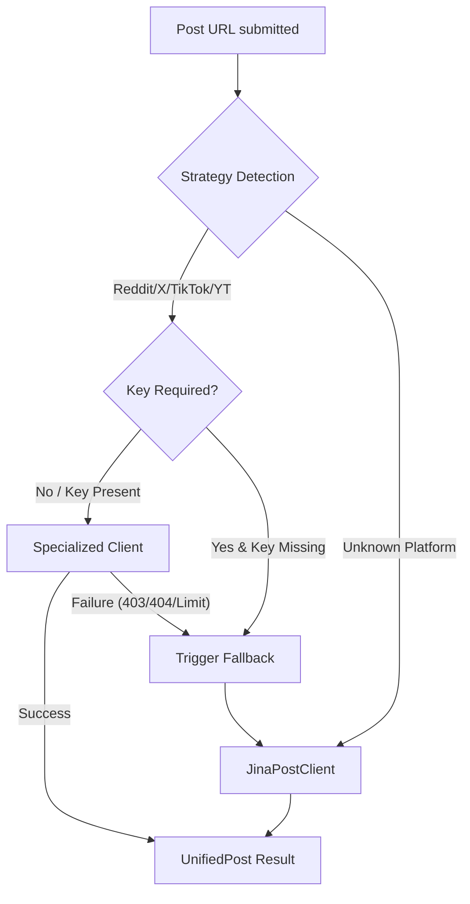

# Contributor notes

This document provides technical context and setup instructions for developers and contributors to the Postcard project.

## Setup

To set up the development environment, perform the following steps:

1.  **Clone the repository:**

    ```bash
    git clone https://github.com/postcardhq/postcard.git
    cd postcard
    ```

2.  Install dependencies:

    ```bash
    npm install
    ```

3.  **Install Playwright browsers:**
    Postcard requires specifically configured browser binaries for forensic scraping:

    ```bash
    npx playwright install
    ```

4.  **Configure environment variables:**
    Copy the template to create your local environment file:

    ```bash
    cp .env.example .env
    ```

    Edit `.env` to include your `GOOGLE_GENERATIVE_AI_API_KEY` if you plan to use the live pipeline.

5.  **Initialize the database:**
    Sync the schema to your local SQLite file:

    ```bash
    npm run db:push
    ```

    You can inspect your local forensic audit logs visually at any time using:

    ```bash
    npm run db:studio
    ```

6.  **Verify the environment:\*\***

    ```bash
    npm run check  # Run linting and type-checks
    ```

7.  **Start the development server:**
    ```bash
    npm run dev
    ```

## Testing

Postcard includes a comprehensive test suite for verifying ingestion strategies and forensic pipelines.

- **Run all tests:** `npm run test`
- **Run in UI mode:** `npx playwright test --ui`

The test suite automatically utilizes the `fake` project configuration to ensure consistent results without consuming AI API credits during local verification.

## Documentation

- **Live Demo:** [postcard.fartlabs.org](https://postcard.fartlabs.org)
- **Hosted Docs:** [Mintlify](https://www.mintlify.com/postcardhq/postcard)
- **OpenAPI:** [openapi.json](../public/openapi.json)

When contributing new features, ensure that the corresponding documentation is updated in the `docs/` folder and that any API changes are reflected in the OpenAPI specification.

## Configuration

Postcard supports two primary development modes, toggled via the `NEXT_PUBLIC_FAKE_PIPELINE` environment variable in your `.env` file.

- Fake Mode (`true`): Uses mock data for all forensic stages. No Gemini API key or external scraping is required. This is the default for rapid UI/UX development.
- Live Mode (`false`): Executes the full forensic pipeline (OCR, Navigator, Auditor, Corroborator). Requires a valid `GOOGLE_GENERATIVE_AI_API_KEY` from [Google AI Studio](https://aistudio.google.com/app/apikey).

### Specialized ingestion keys (optional)

To improve ingestion reliability for platforms that often restrict generic scrapers, you can provide the following optional keys in your `.env`:

- Instagram: Add `INSTAGRAM_ACCESS_TOKEN` from your [Meta for Developers](https://developers.facebook.com/) app to enable high-fidelity oEmbed data.
- Reddit: Add `REDDIT_CLIENT_ID`, `REDDIT_CLIENT_SECRET`, `REDDIT_USERNAME`, and `REDDIT_PASSWORD` for authenticated API access.
- **X (Twitter) & TikTok:** These currently utilize no-auth oEmbed endpoints, but placeholders are available in `.env.example` for future-proofing.

If these keys are omitted, Postcard gracefully falls back to Jina Reader for best-effort ingestion.

### Ingestion strategy logic

When Postcard is in Live Mode, it uses a multi-tier strategy to retrieve post data. The following diagram illustrates how the system chooses between specialized clients and the Jina fallback:



#### Platform configuration reference

| Platform    | Key Required? | Behavior Without Key         | Primary Strategy      |
| :---------- | :------------ | :--------------------------- | :-------------------- |
| Reddit      | No\*          | Uses public `.json` endpoint | `RedditPostClient`    |
| YouTube     | No            | Uses public oEmbed API       | `YoutubePostClient`   |
| X (Twitter) | No            | Uses public oEmbed API       | `XPostClient`         |
| TikTok      | No            | Uses public oEmbed API       | `TikTokPostClient`    |
| Instagram   | Yes           | Falls back to Jina           | `InstagramPostClient` |
| Others      | No            | Hits Jina Reader directly    | `JinaPostClient`      |

_\* Reddit keys are optional but recommended for higher rate limits._

## Database

Postcard uses Drizzle ORM with SQLite for local development.

- Sync Schema: Use `npm run db:push` to apply schema changes from `src/db/schema.ts` to `local.db` without migrations.
- Inspect Data: Use `npm run db:studio` to open the Drizzle Studio GUI for browsing cached analyses and forensic logs.

## Stack

Postcard utilizes a modern, type-safe stack designed for forensic performance and developer velocity.

| Layer         | Choice                   | Why                                                              |
| ------------- | ------------------------ | ---------------------------------------------------------------- |
| Frontend      | Next.js 16               | Provides a responsive dashboard and high-performance API routes. |
| AI / Vision   | Google Gemini            | Enables native multimodal vision and search grounding.           |
| Orchestration | Vercel AI SDK v6         | Supports robust tool calling and typed stream iteration.         |
| Storage       | Drizzle + libSQL (Turso) | Ensures type-safe libSQL persistence for forensic logs.          |
| Automation    | Playwright / sharp       | Handles headless scraping and image preprocessing.               |

## AI SDK

The Postcard pipeline relies heavily on the [Vercel AI SDK v6](https://sdk.vercel.ai/) for complex agentic orchestration.

### AI SDK Skills

The project uses AI SDK Skills to enforce industry-standard best practices. These localized intelligence configurations guide agentic assistants to follow idiomatic patterns for:

- `streamText` iteration
- `toolCall` payload handling
- Multi-step search grounding

This approach ensures 100% type-safety throughout the forensic pipeline.

- [DESIGN.md](DESIGN.md): Overview of the 4-stage forensic pipeline.
- [API.md](API.md): Documentation for public endpoints and the Playwright test suite.
- [TESTING.md](TESTING.md): Manual checklist for verifying pipeline hardening and OG images.

## Style guide

To maintain a professional and consistent technical narrative, all documentation must follow these standards:

### Sentence case titles

Use sentence case for all headings and titles (e.g., "What it does" instead of "What It Does"). Only capitalize proper nouns like "Postcard", "Next.js", or "Vercel".

### Active voice

Prioritize active voice in all technical descriptions. Identify the actor and the action clearly.

- **Good:** "The preprocessor enhances the image."
- **Bad:** "The image is enhanced by the preprocessor."
