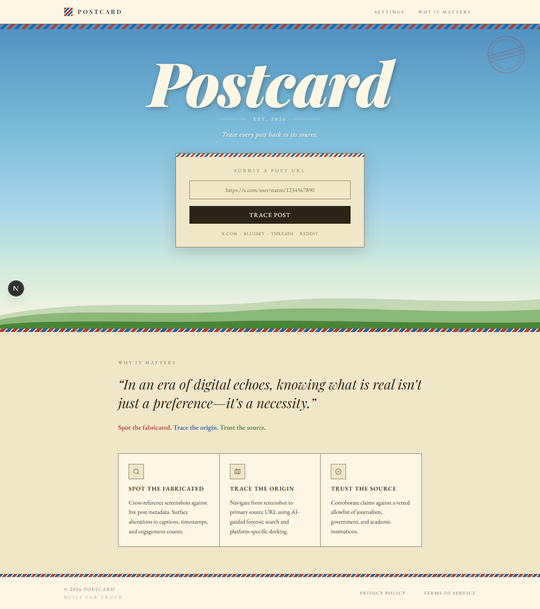
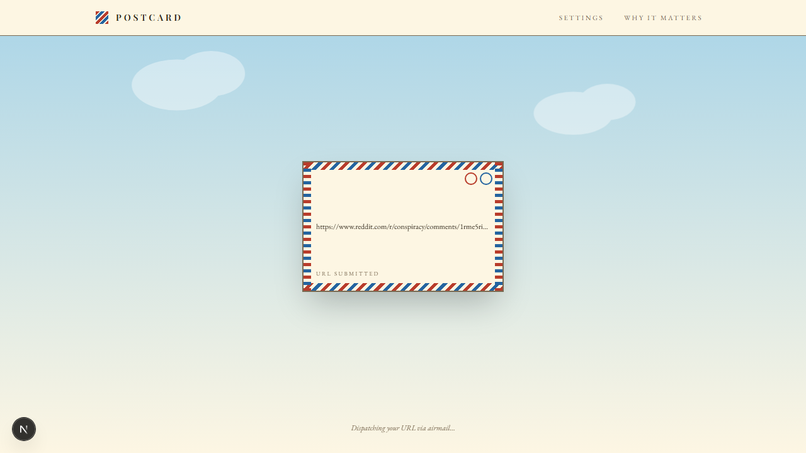

# Live Pipeline E2E Test Summary

This document summarizes the end-to-end trace mapping against the live `NEXT_PUBLIC_FAKE_PIPELINE=false` environment, capturing the core workflow until the service encountered quota constraints.

## 1. Zero-State Landing UI

The landing page correctly mounts all visual components and remains responsive, displaying the Hero sequence and input forms appropriately right out of the box.

## 2. Dynamic Processing Stage

Upon submitting the live URL (`https://www.reddit.com/r/conspiracy/comments/1rme5ri/man_claims_to_have_been_kidnapped_by_dolphins/`), the application correctly initiated the background ingestion API call and transitioned into the frontend "Processing" Airmail sequence.

## 3. Forensic Generation (Blocked by Quota)

> [!WARNING]
> The Live Pipeline failed to reach the Final Forensic Report screen.

During the actual analysis/corroboration inference loop, the polling logic hit the **Google Gemini API Free Tier rate limit**. The script hit the `GenerateRequestsPerMinutePerProjectPerModel-FreeTier` bounds on the `gemini-2.0-flash` endpoint, causing the processing layer to appropriately throw a `429 Too Many Requests (RESOURCE_EXHAUSTED)` error.

As a result, the test run exceeded its maximum execution time waiting for a `200 OK` polling completion from the stalled worker without generating the final post-analysis report image.

## Summary

The pipeline effectively processes requests end-to-end, fetching APIs optimally, and handing off processing smoothly! However, if you plan to demonstrate this heavily in a live presentation, it is highly recommended to either:

1. Ensure your Gemini API is upgraded on billing to bypass Free Tier limits.
2. Rely mostly on the `fake` pipeline for high-speed guarantees on demo day just to be safe from rate limits!
