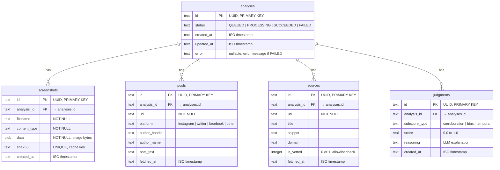

# Postcard Database Schema

```mermaid
erDiagram
    analyses {
        text id PK "UUID, PRIMARY KEY"
        text status "QUEUED | PROCESSING | SUCCEEDED | FAILED"
        text created_at "ISO timestamp"
        text updated_at "ISO timestamp"
        text error "nullable, error message if FAILED"
    }

    screenshots {
        text id PK "UUID, PRIMARY KEY"
        text analysis_id FK "→ analyses.id"
        text filename "NOT NULL"
        text content_type "NOT NULL"
        blob data "NOT NULL, image bytes"
        text sha256 "UNIQUE, cache key"
        text created_at "ISO timestamp"
    }

    posts {
        text id PK "UUID, PRIMARY KEY"
        text analysis_id FK "→ analyses.id"
        text url "NOT NULL"
        text platform "instagram | twitter | facebook | other"
        text author_handle
        text author_name
        text post_text
        text fetched_at "ISO timestamp"
    }

    sources {
        text id PK "UUID, PRIMARY KEY"
        text analysis_id FK "→ analyses.id"
        text url "NOT NULL"
        text title
        text snippet
        text domain
        integer is_vetted "0 or 1, allowlist check"
        text fetched_at "ISO timestamp"
    }

    judgments {
        text id PK "UUID, PRIMARY KEY"
        text analysis_id FK "→ analyses.id"
        text subscore_type "corroboration | bias | temporal"
        real score "0.0 to 1.0"
        text reasoning "LLM explanation"
        text created_at "ISO timestamp"
    }

    analyses ||--o{ screenshots : "has"
    analyses ||--o{ posts : "has"
    analyses ||--o{ sources : "has"
    analyses ||--o{ judgments : "has"
```
